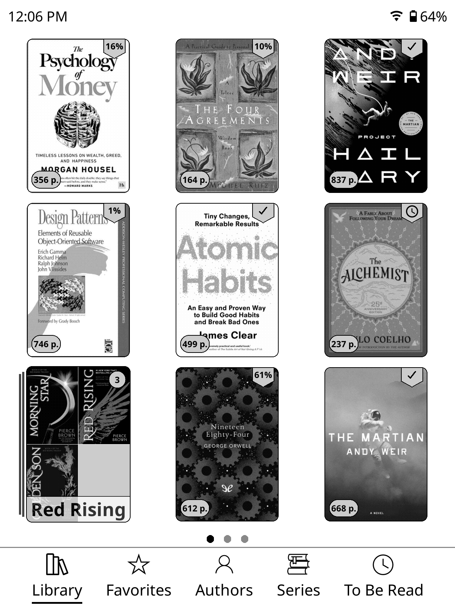
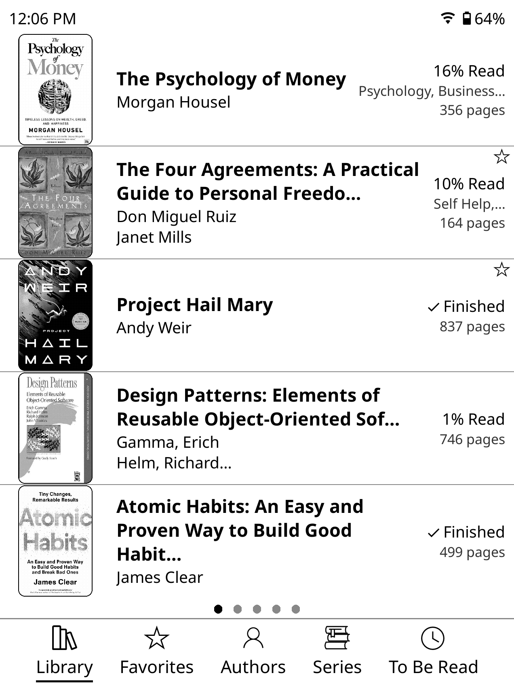
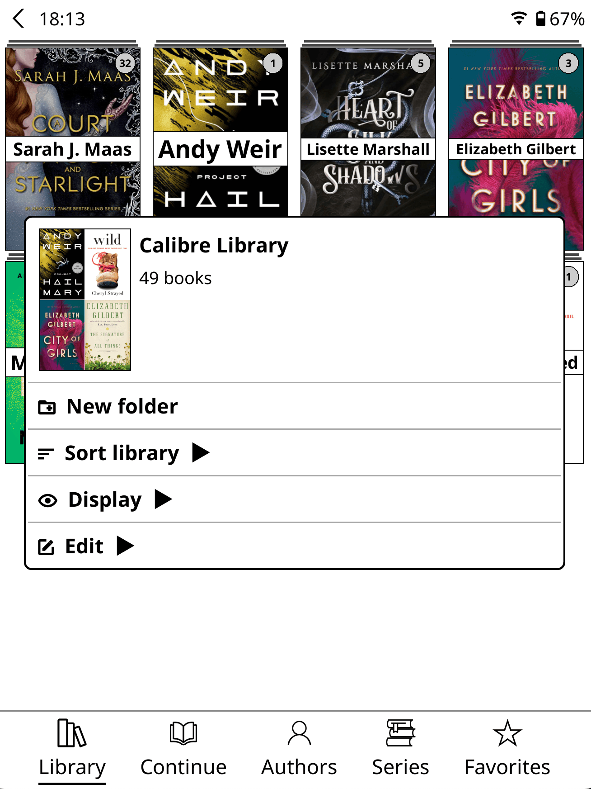

<div align="center">
  <picture>
    <source media="(prefers-color-scheme: dark)" srcset="./icons/zen_ui_light.svg" />
    
  </picture>
</div>

<br>
<br>

<h1 align="center">ZenOS</h1>

<p align="center">A clean, minimal UI for KOReader. </p>

## Documentation
For the most complete and up to date documentation, visit [https://zen-labs.org/zen-ui](https://zen-labs.org/zen-ui)

## Philosophy

ZenOS is built around the simple idea that **less is more.** Everything in ZenOS was designed either to remove clutter or add clear value. The interface stays fast, light, and focused on making reading more enjoyable.

Throughout development, three things were non-negotiable: **performance**, **stability**, and **ease of use**. Every feature was tuned for battery efficiency and responsiveness. 

## Speed & Performance

ZenOS is built to be lightweight and efficient. With libraries containing thousands of books, there are no dramatic changes in speed, responsiveness, or resource usage. Patches are strategically injected and only loaded when needed. ZenOS maintains consistent performance without taxing your device's battery or memory, regardless of the size of your library.

## Features

### Quick Settings Panel
A swipe-down menu accessible anywhere containing all the controls you frequently use — brightness, warmth, WiFi, night mode, sleep, rotation, and more. Fully configurable.


### Library


      


- Clean mosaic and list view options maximizing the size of your book covers with many options
- Book cover gallery for folder thumbnails
- Configurable sorting, items per page, and landscape/portrait layout
- A streamlined context menu in the file browser. Tap and hold to quickly access details, fullscreen cover art, read status and more.




### Bottom Navigation Bar
A clean, tab-based navigation bar at the bottom of the library. Configurable tabs (Library, Manga, Favorites, Authors, History, Collections, and more), with optional labels, custom icons, and sortable layout.


### Zen Mode

Strips down the default KOReader interfaces to their bare essentials. - Hides all the default menus from KOReader leaving only a single unified ZenOS settings tab.


### Lockdown Mode

Creates a more locked-down sandbox for distraction-free reading. Lockdown Mode is designed to keep the device focused on the core flow: browse books and read books. This mode is great for very old or very young readers who shouldn't be burdened by any settings or unnecessary options.

- Restricts access to settings and configuration changes
- Optionally magnify the UI for a larger, simpler view 
- Keeps the experience simple, and reading-first


### Custom Status Bars
A minimal status bar in the reader and a more detailed one in the library. Show only what you want: time, battery, disk space, custom text — all optional and individually toggled.


### Reader Improvements
- Custom page browser (similar to Kindle's) for scrubbing through pages, searching the book, quickly changing the font size.
- Disable bottom menu, prevent unwanted changes to font size.
- Margin gaurd preventing accidentally gestures while holding the edge of the device by it's touchscreen.
- Pick from a hadful of predesigned reader progress bars or create and save your own. Switch presets with a single tap.


### Automated Lighting Schedules
Three independent scheduling systems replace KOReader's limited auto night mode:

- **Night Mode Schedule** — Automatically turn night mode on/off at specified times each day
- **Brightness Schedule** — Schedule brightness levels for night/day
- **Warmth Schedule** — Schedule screen warmth for night/day

Each schedule works individually or together. This granular approach lets you tailor the lighting exactly to your preferences.

### OPDS Plugin Theming
The OPDS plugin respects all your ZenOS library styling settings — creating a unified visual experience across both your local library and online catalogs.

- Mosaic, cover grid, and list view modes from your library settings
- Rounded corners on covers, if enabled
- Default catalog with 1 click access from quick settings

Browse your favorite OPDS sources with the same clean, consistent interface you've customized for your local collection.

## Unified Settings 
- Pulled the most important settings into a single, more streamlined settings tab
- Settings are grouped by feature area (Library, Controls, Launcher, Reader, Extras, About).
- Most features can be toggled independently, some reasonable defaults have been selected.
- Update ZenOS directly from settings without ever leaving KOReader or plugging in to a computer.


## Plugin integration

External plugins can add widgets to the Home page:

```lua
local register = rawget(_G, "__ZENOS_REGISTER_HOME_ITEM")
if register then
    register("my_plugin.summary", function(ctx)
        -- Return a KOReader widget sized to ctx.width and ctx.height.
    end, {
        label = "My summary",
        size = "s",
    })
end
```

The builder receives `width`, `height`, `is_first_row`, and an item-specific
`module_cfg` table. New items are disabled by default and can be enabled and
positioned under **Home > Widgets**. Plugins loaded before ZenOS should register
when they receive `ZenOSReady`; unregister with
`_G.__ZENOS_UNREGISTER_HOME_ITEM(id)`. The legacy `__ZEN_UI_*` aliases remain
available for existing integrations, and `ZenUIReady` is still broadcast.

Home uses a 10-unit height grid: `xs=1`, `s=2`, `m=3`, `l=4`, and
`xl=10` (full screen). Enabled widgets must total at most 10 units. Legacy
`preferred_pct` size tables are still accepted and rounded to the nearest
grid unit.

Registration returns `false` for invalid arguments or a built-in ID collision.
Registering an existing external ID replaces its builder and options.

## Prerequistes

- KOReader must be installed first in order to use ZenOS. [Install KOReader](https://github.com/koreader/koreader#installation)
- Disable or uninstall any **other plugins/patches** that modify the UI such as Simple UI, Project: Title, VOS as they may conflict and cause instability.


## Installation

Already using Zen UI? Update from its settings page instead of installing a
second plugin folder. The updater preserves your settings and completes the
move to ZenOS automatically after restarting KOReader.

The migration performs two automatic restarts. If Zen UI is disabled, enable
it once so its migration can run. Do not manually install `zenos.koplugin`
beside an existing `zen_ui.koplugin` directory.

For a fresh installation:

1. Go to the [Releases](https://github.com/AnthonyGress/zen_ui.koplugin/releases) page and download `zenos.koplugin.zip` from the latest release.
2. Unzip the archive. You should have a **folder** named `zenos.koplugin`.
3. Copy the `zenos.koplugin` **folder** into the KOReader plugins directory for your device: See table below
      - Make sure you are copying the unzipped **folder** and **not the .zip** file itself
4. Restart KOReader. ZenOS will load automatically
      - If you don't see ZenOS load, manually enable the plugin in Tools > More tools > Plugin management > ZenOS
> The final path should look like: `.../plugins/zenos.koplugin/main.lua`


| Device | Plugins directory |
|--------|-------------------|
| **Kobo** | `/mnt/onboard/.adds/koreader/plugins/` |
| **Kindle** | `/mnt/base-us/koreader/plugins/` |
| **PocketBook** | `/mnt/ext1/applications/koreader/plugins/` |
| **Android** | `sdcard/koreader/plugins/` |
| **Desktop (Linux/macOS)** | `/koreader/plugins/` |

## Migrating from Project Title

If you previously used [Project Title](https://github.com/joshuacant/ProjectTitle), you must disable or remove it before using ZenOS. Both plugins patch the Cover Browser, and having both active at the same time will cause conflicts.

Choose one of the following:

- **Remove it** — Delete the `projecttitle.koplugin` folder from your KOReader plugins directory.
- **Disable it** — Rename the folder to `projecttitle.koplugin.disabled`. KOReader will ignore it on next launch.

After disabling or removing Project Title, restart KOReader and ZenOS will load cleanly.

## Localization

ZenOS is currently translated into:

| Locale | Language |
|--------|----------|
| `en` | English |
| `it` | Italian |
| `es` | Spanish |
| `fr` | French |
| `nl` | Dutch |
| `de` | German |
| `bg` | Bulgarian |
| `cs` | Czech |
| `pt_BR` | Brazilian Portuguese |
| `pt_PT` | European Portuguese |
| `ro` | Romanian |
| `ru` | Russian |
| `uk` | Ukrainian |
| `zh_CN` | Simplified Chinese |
| `zh_TW` | Traditional Chinese |
| `zh_HK` | Traditional Chinese (Hong Kong) |
| `zh_MO` | Traditional Chinese (Macau) |
| `el` | Greek |

If you find any issues or corrections to the translations, please feel free to contribute.

To contribute a translation or fix an existing one, see [locales/README.md](locales/README.md) and [CONTRIBUTING.md](CONTRIBUTING.md).

## Credits

ZenOS is original work, but it wouldn't exist without the broader KOReader community. Several open source projects provided components, inspiration, reference implementations, or code that was adapted and built upon:

- **[joshuacant/ProjectTitle](https://github.com/joshuacant/ProjectTitle)** — The plugin that started it all for me. This was my first experience with KOReader plugins and an alternative UI.
- **[qewer33/koreader-patches](https://github.com/qewer33/koreader-patches)** — The bottom navbar and quick settings components. Additional patch approaches and ideas, particularly around UI customization.
- **[sebdelsol/KOReader.patches](https://github.com/sebdelsol/KOReader.patches)** — Patches and UI techniques that informed several of ZenOS's features.
- **[doctorhetfield-cmd/simpleui.koplugin](https://github.com/doctorhetfield-cmd/simpleui.koplugin)** — A fellow KOReader UI plugin that served as an inspiration as well as a model for how to apply language translations throughout the plugin.
- **[kristianpennacchia/zzz-readermenuredesign.koplugin](https://github.com/kristianpennacchia/zzz-readermenuredesign.koplugin)** — Inspiration for the reader search menu redesign

Thank you to everyone who published their KOReader work openly.

## Contributing

Bug reports, feature requests, translations, and code contributions are all welcome. See [CONTRIBUTING.md](CONTRIBUTING.md) for details.

Please follow these guidelines:

- **One feature per PR** - Keep pull requests focused on a single feature or fix
- **PR to dev branch** - Submit PRs to the `dev` branch for testing/review.
- **Review AI-generated code** - If using AI tools, all code must be thoroughly reviewed and tested before submitting (this should happen anyway but even moreso for AI generated code)
- **Maintain consistency** - New code must align with the project's existing style, theme, and overall user experience

## FAQ/Community

Feel free to join the [Discord Community](https://discord.gg/Tv2PhrCPQ8) if you want to get help/chat/contribute

## Security

See [SECURITY.md](SECURITY.md) for how to report vulnerabilities.

## License

[GPL-3.0](LICENSE.md)
